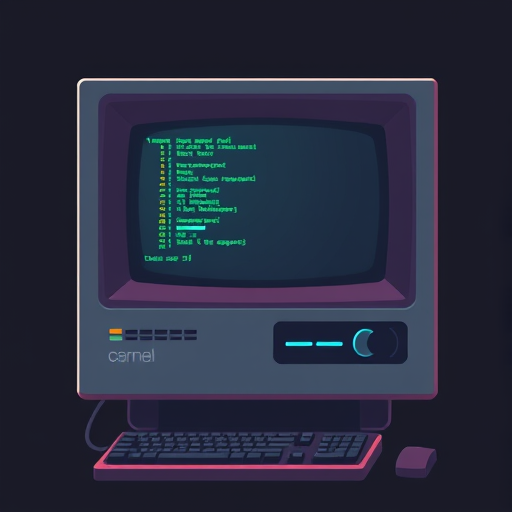
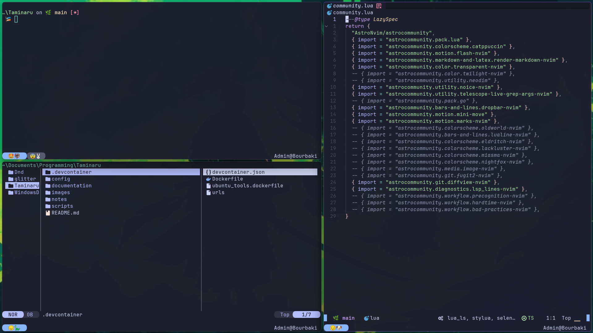

<div>
  


  
</div>

## Usage

Everything is driven from PowerShell. All tools are provisioned with [mise](https://mise.jdx.dev)
(see `mise.toml` / `mise.lock`), and themes are applied from this repo.

### Prerequisites

* `curl`, `git`, `sudo` - must be installed before bootstrapping (the one-liner
  below is fetched with curl, and the bootstrap uses git + sudo throughout)
* [mise](https://mise.jdx.dev/getting-started) - the bootstrap installs it automatically if missing
* PowerShell 7+ (`pwsh`) to run the scripts - only needed for the first bootstrap; after that pwsh itself is provisioned and pinned via mise (see `mise.toml`)

### Bootstrap

Installs all tools with mise (including the `pi` and `mammouth` coding
harnesses), symlinks every `config/*` directory into
`~/.config/*`, wires mise into the pwsh profile, themes the AI coding harnesses
(`pi`, `opencode`, `mammouth`) with catppuccin, and applies the default theme
(frappe).

`curl`, `git` and `sudo` can't be installed by the bootstrap, so install them
first. From a root shell (a fresh Ubuntu install drops you into root):

```bash
apt-get update
apt-get install -y curl git sudo
```

Then provision everything with a single command (mise-style):

```bash
curl -fsSL https://raw.githubusercontent.com/TreeHappy/Taminaru/main/scripts/install.sh | bash
```

The one-liner forwards `FLAVOR` and `TAMINARU_USER`:

```bash
curl -fsSL https://raw.githubusercontent.com/TreeHappy/Taminaru/main/scripts/install.sh | FLAVOR=mocha TAMINARU_USER=bob bash
```

Or, if you already have the repo cloned, run the bootstrap directly:

```bash
bash scripts/bootstrap.sh
```

Running as root (e.g. right after a fresh Ubuntu install) first creates a
non-root user — default name `taminaru`, passwordless with NOPASSWD sudo,
overridable via `TAMINARU_USER=bob bash scripts/bootstrap.sh` — copies this
repo into that user's home, and re-runs the rest of the bootstrap as them, so
you never have to use root. See
[`documentation/passwordless-sudo.md`](documentation/passwordless-sudo.md) for
how passwordless sudo is set up and verified.

It is idempotent and safe to re-run.

Running the tools from a container? `podman exec ... pwsh` won't find pwsh
because exec skips shell startup (so mise is never activated). `podman exec -u
taminaru -it <container> bash` opens an interactive shell that activates mise
and starts pwsh — see
[`documentation/podman-exec.md`](documentation/podman-exec.md).

### Theme switcher

The theme switcher is a pwsh module (`Taminaru.Theme`) that is loaded from your
`$PROFILE`, so you can switch flavors from any pwsh session:

```powershell
Set-TaminaruTheme macchiato    # latte | frappe | macchiato | mocha
Get-TaminaruTheme              # prints the active flavor
```

There is also a CLI wrapper for bash/bootstrap:

```powershell
pwsh ./scripts/theme.ps1            # default: frappe
pwsh ./scripts/theme.ps1 mocha
```
